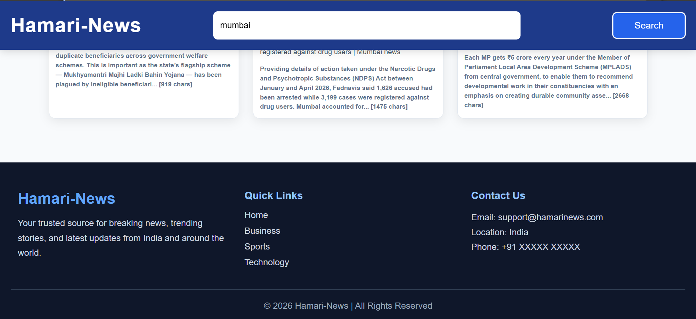

# 📰 Hamari-News

A modern and responsive News Application built with **React.js**, **Vite**, and the **GNews API**. Users can search for the latest news on any topic and view articles in a clean, responsive interface.

---

## 🚀 Features

* 🔍 Search news by keyword
* 📰 Displays the latest news articles
* 🖼️ News image, title, description, and content
* ⚡ Fast performance with Vite
* 📱 Fully responsive design
* 🎨 Modern and clean UI
* ⏳ Loading indicator while fetching news
* 🔒 API key secured using environment variables

---

## 🛠️ Tech Stack

* React.js
* Vite
* JavaScript (ES6+)
* Axios
* CSS3
* GNews API

---

## 📂 Project Structure

```
Hamari-News/
│
├── public/
├── src/
│   ├── components/
│   ├── News.jsx
│   ├── News.css
│   ├── Footer.css
│   └── main.jsx
│
├── .env
├── .gitignore
├── package.json
└── README.md
```

---

## 📸 Screenshots





## 🎯 Future Improvements

* Dark Mode
* Category-wise News
* Bookmark Articles
* Read More Button
* Infinite Scroll
* Pagination
* Voice Search
* Trending News Section

## 👨‍💻 Author

**Azim Bashar**

Front-End Developer | React.js Enthusiast

If you like this project, don't forget to ⭐ the repository.
